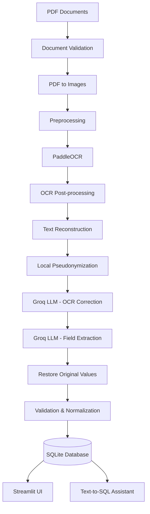

# Analyse Intelligente des Dossiers de Crédit

AI-powered Intelligent Document Processing (IDP) platform that automates the analysis of banking credit files. The system transforms scanned PDF documents into structured, validated data stored in a SQLite database, with a Streamlit interface for upload, search, and natural-language querying.

Developed during an AI Engineering internship at **Banque Populaire Maroc**.

---

## Features

- **End-to-end PDF pipeline** — validation, image preprocessing, OCR, LLM correction, field extraction, validation, normalization, and database storage
- **Image preprocessing** — grayscale, deskew, denoising, contrast enhancement, and resize to improve OCR accuracy
- **OCR with PaddleOCR** — text detection, recognition, confidence filtering, and reading-order reconstruction
- **LLM-powered extraction** — Groq API for OCR correction and structured field extraction (JSON Schema)
- **Data privacy** — local pseudonymization of sensitive data (CIN, names, account numbers) before any text is sent to external LLMs
- **Field validation & normalization** — business rules for Moroccan banking documents
- **SQLite persistence** — clients, credit dossiers, documents, pages, OCR results, extracted fields, and validation results
- **Streamlit web UI** — upload PDFs, browse dossiers, and query the database in natural language
- **Text-to-SQL assistant** — ask questions about credit files; the system generates, validates, and executes SQL safely

---

## Architecture



### Pipeline steps

1. Validate the PDF document
2. Convert each page to an image
3. Preprocess images (grayscale → deskew → denoise → contrast → resize)
4. Run PaddleOCR on each page
5. Filter low-confidence detections and reconstruct reading order
6. Pseudonymize sensitive information locally
7. Send pseudonymized text to Groq for OCR correction
8. Send pseudonymized document to Groq for structured field extraction
9. Restore original sensitive values
10. Validate and normalize extracted fields
11. Persist everything to SQLite

### Extracted fields

| Field | Description |
|-------|-------------|
| `cin` | National ID (CIN) |
| `nom_prenom` | Client full name |
| `numero_compte` | Bank account number |
| `nature_credit` | Credit type |
| `montant_credit` | Credit amount |
| `date_de_decision` | Decision date |
| `date_archivage` | Archive date |

---

## Tech Stack

| Layer | Technologies |
|-------|--------------|
| Language | Python 3.10 |
| Computer vision | OpenCV, NumPy, Pillow |
| PDF processing | pdf2image, Poppler |
| OCR | PaddleOCR, PaddlePaddle |
| LLM | Groq API (`openai/gpt-oss-120b`) |
| Database | SQLite |
| Web UI | Streamlit |
| NLP / SQL | Text-to-SQL pipeline with SQL validation |

---

## Project Structure

```
MVP-Analyse-Intelligente-Des-Dossiers-De-Credit/
├── app/
│   ├── main.py                 # CLI batch processor
│   ├── pipeline.py             # End-to-end document pipeline
│   ├── config.py               # Paths and environment config
│   ├── preprocessing/          # PDF conversion & image preprocessing
│   ├── ocr/                    # PaddleOCR integration
│   ├── postprocessing/         # OCR filtering & text reconstruction
│   ├── llm/                    # Groq client, prompts, field extraction
│   ├── security/               # Local pseudonymization
│   ├── validation/             # Field validation rules
│   ├── normalization/          # Data normalization
│   ├── text2sql/               # Natural-language SQL assistant
│   └── ui/                     # Streamlit application
├── data/
│   ├── input/                  # Input PDF files (CLI mode)
│   ├── processed/              # Intermediate images & JSON (optional)
│   └── database/               # SQLite DB & repository layer
├── requirements.txt
└── .env                        # API keys & paths (not committed)
```

---

## Prerequisites

- **Python 3.10**
- **Poppler** — required by `pdf2image` for PDF-to-image conversion
  - Windows: download from [poppler-windows](https://github.com/oschwartz10612/poppler-windows/releases) and set `POPPLER_PATH` in `.env`
  - Linux: `sudo apt install poppler-utils`
  - macOS: `brew install poppler`
- **Groq API key** — sign up at [console.groq.com](https://console.groq.com)

---

## Installation

```bash
# Clone the repository
git clone https://github.com/<your-username>/MVP-Analyse-Intelligente-Des-Dossiers-De-Credit.git
cd MVP-Analyse-Intelligente-Des-Dossiers-De-Credit

# Create and activate a virtual environment
python -m venv .venv
.venv\Scripts\activate        # Windows
# source .venv/bin/activate   # Linux / macOS

# Install dependencies
pip install -r requirements.txt

# Initialize the database
python -m data.database.init_database
```

---

## Configuration

Create a `.env` file at the project root:

```env
GROQ_API_KEY=your_groq_api_key_here

# Required on Windows if Poppler is not on PATH
POPPLER_PATH=C:\path\to\poppler\Library\bin
```

Optional database variables (reserved for future use):

```env
DB_HOST=
DB_PORT=
DB_NAME=
DB_USER=
DB_PASSWORD=
```

---

## Usage

### Option 1 — Streamlit web application (recommended)

```bash
python -m streamlit run app/ui/streamlit_app.py
```

The UI provides four sections:

- **Accueil** — project overview
- **Dossiers** — upload PDFs, run the pipeline, browse stored credit files
- **Credit Assistant** — ask natural-language questions about the database (Text-to-SQL)
- **Paramètres** — application settings overview

### Option 2 — CLI batch processing

Place one or more PDF files in `data/input/`, then run:

```bash
python -m app.main
```

Each PDF is processed sequentially. A summary is printed with dossier ID, extracted fields, and validation status.

---

## Database Schema

| Table | Purpose |
|-------|---------|
| `client` | Client identity (CIN, name) |
| `dossier_credit` | Credit dossier metadata |
| `document` | Source PDF metadata |
| `document_page` | Per-page image references |
| `ocr_results` | Raw and corrected OCR text per page |
| `extracted_fields` | LLM-extracted banking fields |
| `validation_results` | Per-field validation status |

Database file: `data/database/credit_analysis.db`

To reset the database:

```bash
python -m data.database.clear_database
python -m data.database.init_database
```

---

## Security & Privacy

Sensitive customer data is **never sent in plain text** to external LLM services. The `Pseudonymizer` module:

1. Detects CINs, account numbers, and customer names in OCR text
2. Replaces them with reversible tokens (e.g. `[PERSON_001]`)
3. Sends only pseudonymized text to Groq
4. Restores original values locally after LLM processing

This approach reduces exposure of PII during OCR correction and field extraction.

---

## Development Status

| Phase | Status |
|-------|--------|
| Document preprocessing | Done |
| OCR integration (PaddleOCR) | Done |
| OCR correction & field extraction (Groq) | Done |
| Validation & normalization | Done |
| SQLite integration | Done |
| Batch PDF processing | Done |
| Streamlit UI | Done |
| Text-to-SQL assistant | Done |
| Full RAG over document text | Planned |
| Configurable pipeline settings | Planned |

---

## Roadmap

- [ ] Retrieval-Augmented Generation (RAG) over full OCR text
- [ ] Search by CIN and advanced filters
- [ ] Configurable LLM and OCR settings from the UI
- [ ] Export reports (PDF / Excel)
- [ ] PostgreSQL support for production deployment

---

## Disclaimer

This project is an **MVP developed in an academic / internship context**. It is not intended for production use without further security audits, compliance review, and hardening. Do not commit real customer data or API keys to version control.

---

## Acknowledgments

- **Banque Populaire Maroc** — internship host and project context
- [PaddleOCR](https://github.com/PaddlePaddle/PaddleOCR) — open-source OCR engine
- [Groq](https://groq.com) — fast LLM inference API

---

## License

This repository does not include a license file yet. Contact the project maintainers before reusing or distributing the code.
