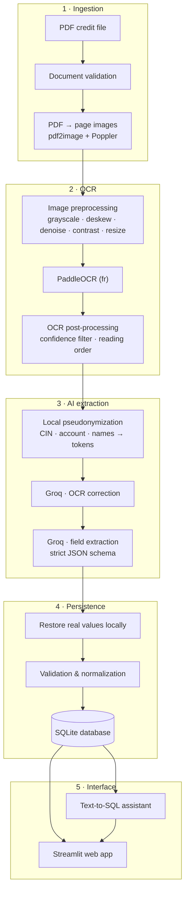
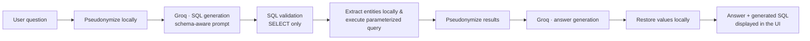

# 🏦 Analyse Intelligente des Dossiers de Crédit


**Intelligent Document Processing (IDP) platform that turns scanned banking credit files into structured, validated and queryable data.**

The platform automates the analysis of *"Fiches de Décision"* — the scanned PDF credit decision forms used in Moroccan retail banking. Each document is validated, preprocessed, read with OCR, corrected and interpreted by an LLM, and checked against business rules before being stored in a relational database. A Streamlit web application then allows users to upload documents, browse credit dossiers, search by CIN, and ask questions about the data in natural language.

Developed during an AI Engineering internship at **Banque Populaire Maroc**.

---

## 📖 Contents

- [Key Features](#-key-features)
- [Architecture](#-architecture)
- [Tech Stack](#-tech-stack)
- [Project Structure](#-project-structure)
- [Getting Started](#-getting-started)
- [Running the Application](#-running-the-application)
- [Using the Web Application](#-using-the-web-application)
- [Database Schema](#-database-schema)
- [Security & Privacy](#-security--privacy)
- [Project Status](#-project-status)
- [Roadmap](#-roadmap)
- [Disclaimer](#-disclaimer)

---

## ✨ Key Features

### Document processing

- **End-to-end PDF pipeline** — validation, page conversion, image preprocessing, OCR, LLM correction, field extraction, validation, normalization and database storage
- **Image preprocessing** — grayscale conversion, deskew, denoising, contrast enhancement and resizing to maximize OCR accuracy
- **OCR with PaddleOCR** — French-language text detection and recognition, low-confidence filtering and reading-order reconstruction

### AI-powered extraction

- **LLM OCR correction** — Groq (`openai/gpt-oss-120b`) cleans OCR noise from the reconstructed text
- **Structured field extraction** — strict JSON Schema via Groq Structured Outputs guarantees well-formed, parseable results
- **Field validation & normalization** — business rules for Moroccan banking documents (allowed credit types, amounts, dates)

### Security & privacy

- **Local pseudonymization** — CINs, account numbers and client names are replaced with reversible tokens before any text is sent to an external LLM, then restored locally afterwards
- **Safe Text-to-SQL** — only read-only, single-statement `SELECT` queries are accepted, executed with bound parameters so sensitive values never reach the LLM in clear text

### Data & interface

- **SQLite persistence** — clients, credit dossiers, documents, pages, OCR results, extracted fields and validation results
- **Streamlit web UI** — PDF upload with live progress, dossier cards, search by CIN, chat assistant and settings page
- **CLI batch mode** — process every PDF in an input folder from the command line
- **Docker support** — multi-stage image and `docker compose` setup with persistent volumes

---

## 🏗 Architecture

### Document processing pipeline



### Text-to-SQL assistant (security-first design)



### Module map

| Module | Responsibility |
|--------|----------------|
| `app/pipeline.py` | `DocumentPipeline` — orchestrates every step from PDF to database |
| `app/main.py` | CLI entry point — batch-processes all PDFs found in `data/input/` |
| `app/config.py` | Paths, Poppler configuration, OCR language, environment variables |
| `app/preprocessing/` | PDF→image conversion, grayscale, deskew, denoise, contrast, resize |
| `app/ocr/` | PaddleOCR integration |
| `app/postprocessing/` | Low-confidence filtering and reading-order text reconstruction |
| `app/llm/` | Groq client, prompts, field extractor (+ experimental Ollama client) |
| `app/security/` | `Pseudonymizer` — PII detection, tokenization and restoration |
| `app/validation/` · `app/normalization/` | Business validation rules and field normalization |
| `app/data/database/` | SQLite connection, schema, database manager and repositories |
| `app/text2sql/` | Schema manager, SQL generator / validator / executor, answer generator |
| `app/ui/` | Streamlit app, views, components and styling |

### Pipeline steps

1. Validate the uploaded PDF document
2. Convert each page to an image (pdf2image + Poppler)
3. Preprocess images: grayscale → deskew → denoise → contrast → resize
4. Run PaddleOCR on every page (French model, CPU)
5. Filter low-confidence detections and reconstruct reading order
6. Pseudonymize sensitive information locally (tokens are consistent across pages)
7. Send pseudonymized text to Groq for OCR correction
8. Send the merged pseudonymized document to Groq for structured field extraction
9. Restore original sensitive values locally
10. Validate extracted fields against business rules and normalize them
11. Persist dossier, document, pages, OCR results, extracted fields and validation results to SQLite
12. Return a full summary (dossier ID, extracted fields, validation status)

### Extracted fields

| Field | Description |
|-------|-------------|
| `cin` | National ID card number (CIN) |
| `nom_prenom` | Client full name |
| `numero_compte` | Bank account number |
| `nature_credit` | Credit type — validated against: Crédit Immobilier, Crédit Consommation, Crédit Automobile, Crédit Personnel, Crédit Étudiant |
| `montant_credit` | Credit amount |
| `date_de_decision` | Decision date |
| `date_archivage` | Archive date |

---

## 🧰 Tech Stack

| Layer | Technologies |
|-------|--------------|
| Language | Python 3.10 |
| Computer vision | OpenCV 4.11, NumPy 1.26, Pillow 12.3 |
| PDF processing | pdf2image 1.17 + Poppler |
| OCR | PaddleOCR 2.8.1 / PaddlePaddle 2.6.2 (CPU) |
| LLM | Groq API — `openai/gpt-oss-120b` (structured outputs, hidden reasoning) |
| Local LLM (optional) | Ollama client (`qwen2.5:7b`) — implemented, not enabled by default |
| Database | SQLite 3 |
| Web UI | Streamlit 1.60 |
| Assistant | Text-to-SQL pipeline with SQL validation and parameterized execution |
| Deployment | Docker (multi-stage Python 3.10-slim image), docker compose |

---

## 📁 Project Structure

```
MVP-Analyse-Intelligente-Des-Dossiers-De-Credit/
├── app/
│   ├── main.py                     # CLI batch processor (entry point)
│   ├── pipeline.py                 # DocumentPipeline — end-to-end orchestrator
│   ├── config.py                   # Paths, Poppler and OCR configuration
│   ├── data/
│   │   ├── input/                  # Sample PDF credit files (CLI mode)
│   │   ├── processed/              # Intermediate images and OCR JSON artifacts
│   │   ├── output/                 # Generated outputs
│   │   └── database/               # SQLite database and persistence layer
│   │       ├── connection.py       # Low-level SQLite connection manager
│   │       ├── database_manager.py # Schema creation and insert operations
│   │       ├── dossier_repository.py # Read queries used by the UI
│   │       ├── models.py           # Dataclasses + CREATE TABLE statements
│   │       ├── init_database.py    # Database creation script
│   │       └── clear_database.py   # Database reset script
│   ├── preprocessing/              # PDF conversion and image enhancement
│   ├── ocr/                        # PaddleOCR integration
│   ├── postprocessing/             # OCR filtering and text reconstruction
│   ├── llm/                        # Groq client, prompts, field extraction
│   ├── security/                   # Local pseudonymization (PII protection)
│   ├── validation/                 # Business validation rules
│   ├── normalization/              # Field normalization
│   ├── text2sql/                   # Secure natural-language SQL assistant
│   └── ui/                         # Streamlit application
│       ├── streamlit_app.py        # App entry point and navigation
│       ├── style.css               # Custom styling
│       ├── views/                  # home · dossiers · assistant · settings
│       ├── components/             # Reusable UI cards
│       └── assets/                 # Branding assets
├── Dockerfile                      # Multi-stage image (Python 3.10-slim, CPU)
├── docker-compose.yml              # Service, ports and persistent volumes
├── requirements.txt                # Pinned dependencies
├── .env                            # API keys — created by you, never committed
└── README.md
```

> **Note — data paths at runtime:** the application resolves `data/…` paths **relative to the directory it is launched from**. Running from the project root (recommended) creates and uses a root-level `data/` folder automatically. The `app/data/` folders shipped in the repository contain sample documents and artifacts.

---

## 🚀 Getting Started

### Prerequisites

- **Python 3.10** (recommended — matches the Docker image)
- **Poppler** — required by `pdf2image` for PDF-to-image conversion
  - **Windows**: download from [poppler-windows](https://github.com/oschwartz10612/poppler-windows/releases) and set `POPPLER_PATH` in `.env`
  - **Linux**: `sudo apt install poppler-utils`
  - **macOS**: `brew install poppler`
- **Groq API key** — create one at [console.groq.com](https://console.groq.com)
- Optional: **Docker** for containerized deployment

### Installation

```bash
# Clone the repository
git clone https://github.com/idrissizineb/MVP-Analyse-Intelligente-Des-Dossiers-De-Credit.git
cd MVP-Analyse-Intelligente-Des-Dossiers-De-Credit

# Create and activate a virtual environment
python -m venv .venv
.venv\Scripts\activate         # Windows
# source .venv/bin/activate    # Linux / macOS

# Install dependencies
pip install -r requirements.txt

# Initialize the SQLite database
python -m app.data.database.init_database
```

The database (and its parent folders) is also created automatically the first time the application runs.

### Configuration

Create a `.env` file at the project root:

```env
# Required — Groq API key (https://console.groq.com)
GROQ_API_KEY=your_groq_api_key_here

# Optional — Windows only, if Poppler is not on PATH
# POPPLER_PATH=C:\path\to\poppler\Library\bin
```

| Variable | Required | Description |
|----------|----------|-------------|
| `GROQ_API_KEY` | ✅ | Used for OCR correction, field extraction and the Credit Assistant |
| `POPPLER_PATH` | — | Path to Poppler's `bin` folder. Read **only on Windows**; on Linux/macOS and in Docker, `poppler-utils` is expected on `PATH` |

---

## 💻 Running the Application

> Run the commands below from the **project root** so that `data/…` paths resolve consistently.

### Option 1 — Streamlit web application (recommended)

```bash
python -m streamlit run app/ui/streamlit_app.py
```

Then open **http://localhost:8501** in your browser.

### Option 2 — CLI batch processing

Place one or more PDF files in `data/input/` (sample documents are available in `app/data/input/`), then run:

```bash
python -m app.main
```

Each PDF is processed sequentially and a summary is printed with the dossier ID, the extracted fields and the validation status.

### Option 3 — Docker

```bash
docker compose up --build
```

- The web UI is exposed on **port 8501**; port 8000 is reserved for a future REST API.
- `data/` folders (input, processed, output, database) and the PaddleOCR model cache are mounted as volumes, so documents and the database survive container restarts.
- The container reads `GROQ_API_KEY` and other variables from the root `.env` file.

---

## 🧭 Using the Web Application

| Page | What you can do |
|------|-----------------|
| 🏠 **Accueil** | Project overview |
| 📁 **Dossiers** | Upload one or more PDFs, launch the analysis pipeline with live progress, review extracted fields as cards, and search dossiers by **CIN** |
| 💬 **Credit Assistant** | Ask questions in natural language — for example *"Quel est le montant du crédit de M. Dupont ?"* or *"Quels dossiers sont enregistrés ?"*. The generated SQL and the raw results are displayed in expandable sections |
| ⚙️ **Paramètres** | Overview of the current configuration (database path, OCR settings) |

---

## 🗄 Database Schema

| Table | Purpose | Main columns |
|-------|---------|--------------|
| `client` | Client identity | `cin` (unique), `nom_prenom` |
| `dossier_credit` | Credit dossier | `client_id` → `client`, `numero_compte`, `nature_credit`, `montant_credit`, `date_de_decision`, `date_archivage`, `statut` (default `en_analyse`) |
| `document` | Source PDF metadata | `dossier_id`, `nom_fichier`, `type_document`, `nombre_pages`, `chemin_fichier` |
| `document_page` | Per-page image references | `document_id`, `numero_page`, `chemin_image` |
| `ocr_results` | OCR output per page | `page_id`, `raw_text`, `corrected_text`, `raw_ocr_json`, `ocr_engine` |
| `extracted_fields` | LLM-extracted fields | `document_id`, `field_name`, `field_value`, `normalized_value` |
| `validation_results` | Per-field validation status | `document_id`, `field_name`, `field_value`, `status`, `error_message` |

Database file: `data/database/credit_analysis.db` (relative to the launch directory).

To reset the database (⚠️ **deletes all stored dossiers** — the database file must already exist):

```bash
python -m app.data.database.clear_database
python -m app.data.database.init_database
```

---

## 🔐 Security & Privacy

Sensitive customer data is **never sent in clear text** to external LLM services. The `Pseudonymizer` module:

1. Detects CINs, account numbers and client names in the OCR text — as well as in user questions and SQL results
2. Replaces them with reversible tokens (e.g. `[PERSON_001]`); the same value always receives the same token, even across pages
3. Sends only pseudonymized text to Groq
4. Restores the original values locally after LLM processing

This protects PII during OCR correction, field extraction **and** natural-language question answering.

### SQL safety

The assistant never executes raw LLM output blindly. The `SQLValidator`:

- allows **only** queries starting with `SELECT`
- rejects multiple statements (`;`)
- blocks destructive keywords: `INSERT`, `UPDATE`, `DELETE`, `DROP`, `ALTER`, `CREATE`, `PRAGMA`, `ATTACH`, `DETACH`, `VACUUM`, `REINDEX`, `TRUNCATE`, `REPLACE`
- blocks access to SQLite internals (`sqlite_master`, `sqlite_sequence`)
- executes queries with **bound parameters**, so real client names never appear in the SQL text sent to the database

---

## 📌 Project Status

| Phase | Status |
|-------|--------|
| Document preprocessing | ✅ Done |
| OCR integration (PaddleOCR) | ✅ Done |
| OCR correction & field extraction (Groq) | ✅ Done |
| Validation & normalization | ✅ Done |
| SQLite integration | ✅ Done |
| Batch PDF processing (CLI) | ✅ Done |
| Streamlit UI (upload, CIN search, assistant) | ✅ Done |
| Text-to-SQL assistant | ✅ Done |
| Docker packaging | ✅ Done |
| Full RAG over document text | 🚧 Planned |
| Ollama as offline LLM alternative | 🚧 Planned (client implemented, not wired in) |
| Configurable pipeline settings | 🚧 Planned |

---

## 🗺 Roadmap

- [ ] Retrieval-Augmented Generation (RAG) over full OCR text
- [ ] Configurable LLM and OCR settings from the UI
- [ ] Export reports (PDF / Excel)
- [ ] PostgreSQL support for production deployment
- [ ] Wire the Ollama client as a fully offline alternative to Groq

---

## 🚨 Disclaimer

This project is an **MVP developed in an academic / internship context**. It is not intended for production use without further security audits, compliance review and hardening. Do not commit real customer data or API keys to version control.

---

## 🙏 Acknowledgments

- **Banque Populaire Maroc** — internship host and project context
- [PaddleOCR](https://github.com/PaddlePaddle/PaddleOCR) — open-source multilingual OCR engine
- [Groq](https://groq.com) — fast LLM inference API
- [Streamlit](https://streamlit.io) — framework for building data applications

---

## 📄 License

This repository does not include a license file yet. Contact the project maintainers before reusing or distributing the code.
